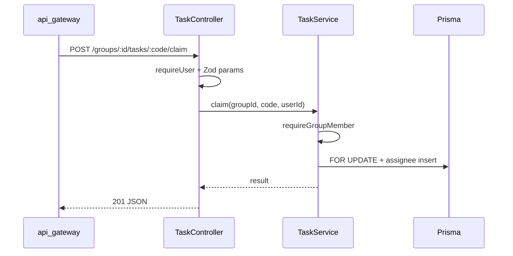

# Backend API MVC + SOLID/DRY Structure

**Date:** 2026-09-28  
**Status:** Approved approach (common helpers first → per-service MVC)  
**Related:** Phase 1/1.5 Alpha services (`identity`, `core`, `chat`, `api-gateway`)

## 1. Problem

- Business logic, HTTP parsing, and Prisma access live mostly in monolithic `index.ts` files (worst: `core-service` ~775 LOC).
- Cross-service duplication: `sendError`, Bearer JWT `requireUser`, JWT secret bootstrap, `sha256` / `randomToken`.
- Hard to extend without copy-paste; violates DRY and single-responsibility.

## 2. Goals / Non-goals

**Goals**

- Shared HTTP/auth/crypto helpers in `@manage-teams/common` (no new package).
- Light MVC per service: `routes` → `controllers` → `services` (+ `dto`); Prisma stays in services (no second ORM wrapper).
- Preserve existing HTTP contracts and error codes.
- Gateway stays flat; may reuse `verifyAccessToken` from common.

**Non-goals**

- NestJS / DI container / CQRS.
- Extracting a separate `@manage-teams/http` package (rejected in favor of extending `common`).
- Changing Flutter client contracts in this refactor.
- Full repository layer for every table (services may call `prisma` directly; extract repo only when a domain has multiple entry points needing the same queries).

## 3. Shared layer (`@manage-teams/common`)

| Module | Responsibility |
|--------|----------------|
| `http.ts` | `sendError(res, err, logger?)`; optional `asyncHandler(fn)` for Express |
| `auth.ts` | `getJwtSecret()`, `verifyAccessToken(token)`, `requireUser(req)` → `{ id, email }` |
| `crypto.ts` | `sha256`, `randomToken` (node:crypto); **not** Argon2/OTP (identity-only) |

Dependencies: add `jose` (and optionally `@types/express` as peer/dev) to `common` so `requireUser` can type `Request`. Prefer typing against a minimal `{ header(name): string | undefined }` interface to avoid forcing Express as a hard runtime dep if possible — use Express `Request` via peerDependency.

Export from `packages/common/src/index.ts`.

**Prisma P2002:** `sendError` may optionally map unique violations when `Prisma.PrismaClientKnownRequestError` is detected — keep mapping thin; identity can pass a mapper hook if needed to avoid `@prisma/client` coupling in common. Preferred: identity controller catches P2002 locally for `EMAIL_TAKEN`; common `sendError` stays framework-agnostic (AppError + Zod issues + 500).

## 4. Per-service MVC layout

```
apps/<service>/src/
  index.ts                 # listen / bootstrap only
  app.ts                   # express() + json + mount routers + /health
  routes/<domain>.routes.ts
  controllers/<domain>.controller.ts   # parse body/params → service → res
  services/<domain>.service.ts         # rules + prisma (+ outbox)
  dto/<domain>.schemas.ts              # zod
```

**Layer rules (SOLID)**

- **Controller (SRP):** HTTP only — Zod parse, status codes, call one service method, `sendError`.
- **Service (SRP + DIP):** Domain rules; depends on `prisma` / mailer interfaces, not on Express `req`/`res`.
- **DTO:** Single source for request shapes; delete unused duplicate schema files.
- **DRY:** AuthZ helpers shared inside the service (`requireOrgAdmin`, `requireGroupMember`) live in `services/access.service.ts` or `lib/access.ts`, not copy-pasted in every controller.

**api-gateway:** keep `index.ts` + `auth-guard.ts` + `correlation.ts`; `auth-guard` should call `verifyAccessToken` from common.

## 5. Migration order (C)

1. **Common helpers** + unit tests + wire identity/core/chat `sendError`/`requireUser` to common (behavior unchanged).
2. **core-service** MVC split (org / group / task) — largest win.
3. **identity-service** — move routes out of `index`; keep existing `otp`, `google-*` as services/modules.
4. **chat-service** — split HTTP controllers from Socket.IO bootstrap (`socket.ts`).

Each step: typecheck + existing vitest green; no intentional HTTP contract changes.

## 6. Example flow (task claim)



## 7. Acceptance

- [ ] No duplicated `sendError` / `requireUser` / JWT secret bootstrap in identity, core, chat.
- [ ] Each of those services: `index.ts` ≤ ~50 LOC; domain logic not in route handlers beyond glue.
- [ ] `pnpm` typecheck + tests pass for common, identity, core, chat, gateway.
- [ ] Manual smoke: register/login, create org→group→task→claim, list/send conversation message still work.

## 8. Out of scope / later

- OpenAPI generation from Zod.
- Redis cache invalidation helpers.
- Moving mailer stubs into a shared package.
